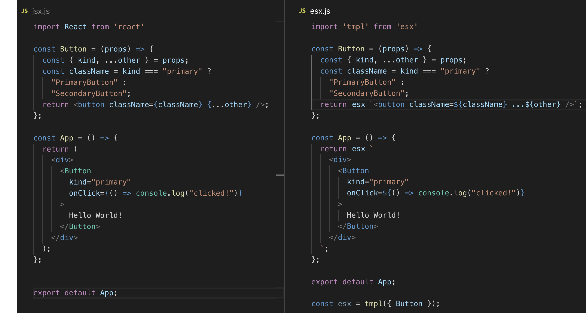

# esx 

[](https://travis-ci.org/esxjs/esx)
[](https://codecov.io/gh/esxjs/esx)
[](http://standardjs.com/)

High throughput React Server Side Rendering


For a simplified example of `esx` in action, check out [esx-demo](https://github.com/esxjs/esx-demo).

`esx` is designed to be a **high speed SSR template engine for React**.

It can be used with **absolutely no code base changes**. 

Use it with a [preloader flag](https://nodejs.org/api/cli.html#cli_r_require_module) like so:

```sh
node -r esx/optimize my-app.js
```

*Note: transpiling is still experimental*.

Alternatively [babel-plugin-esx-ssr](https://github.com/esxjs/esx/blob/babel-plugin-esx-ssr) can be used to transpile for the same performance gains. The babel plugin would be a preferred option where speed of process initialization is important (such as serverless).

Optionally, `esx` is also a universal **JSX-like syntax in plain JavaScript** that allows for the elimination of transpilation in development environments.

* For the server side, using `esx` syntax  will yield the same high speed results as the optimizing preloader
* For client side development, using `esx` syntax can enhance development workflow by removing the need for browser transpilation when developing in modern browsers
* For client side production `esx` can be compiled away for production with [babel-plugin-esx-browser](https://github.com/esxjs/babel-plugin-esx-browser), resulting in zero-byte payload overhead. 

It uses native [Tagged Templates](https://developer.mozilla.org/en-US/docs/Web/JavaScript/Reference/Template_literals#Tagged_templates) and works in all modern browsers.

<p align="center">
  
</p>

## Status

Not only is this project on-going, it's also following a moving
target (the React implementation). 

This should only be used in production when:

* It has been verified to yield significant enough performance gains
* It has been thoroughly verified against your current implementation

`esx` needs use cases and battle testing. All issues are very welcome,
PR's are extremely welcome and Collaborators are exceptionally, extraordinarily, exceedingly welcome.

## Install

```js
npm i esx
```

## Tests

There are close to 3000 passing tests.

```sh
git clone https://github.com/esxjs/esx
cd esx
npm i
npm test
npm run test:client # test client-side implementation in node
npm tun test:browser # test client-side implementation in browser
```

## Syntax

Creating HTML with `esx` syntax is as close as possible to JSX:

- Spread props: `<div ...${props}>`
- Self-closing tags: `<div />`
- Attributes: `` and ``
- Boolean attributes: `<div draggable />`
- Components: `<Foo/>`
  - Components must be registered with `esx`: `esx.register({Foo})`

## Compatibility

* `react` v16.8+ is required as a peer dependency
* `react-dom` v16.8+ is required as a peer dependency
* `esx` is built for Node 10+
* Supported Operating Systems: Windows, Linux, macOS

## Limitations

`esx` should cover the API surface of all *non-deprecated* React features.

Notably, `esx` will not work with the [Legacy Context API](https://reactjs.org/docs/legacy-context.html),
but it will work with the [New Context API](https://reactjs.org/docs/context.html).

While the legacy API is being phased out, there still may be modules in a 
projects depedency tree that rely on the legacy API. If you desperately need
support for the legacy API, <a href="https://twitter.com/messages/compose?recipient_id=323355503">contact me</a>..

## Usage

### As an optimizer 

Preload `esx/optimize` like so:

```sh
node -r esx/optimize my-app.js
```

That's it. This will convert all `JSX` and `createElement` calls to ESX format, 
unlocking the throughput benefits of SSR template rendering.

### As a JSX replacement

Additionally, `esx` can be written by hand for great ergonomic benefit
in both server and client development contexts. Here's the example
from the [`htm`](https://github.com/developit/htm) readme converted
to `esx` (`htm` is discussed at the bottom of this readme):

```js
// using require instead of import allows for no server transpilation
const { Component } = require('react') 
const esx = require('esx')()
class App extends Component {
  addTodo() {
    const { todos = [] } = this.state;
    this.setState({ todos: todos.concat(`Item ${todos.length}`) });
  }
  render({ page }, { todos = [] }) {
    return esx`
      <div class="app">
        <Header name="ToDo's (${page})" />
        <ul>
          ${todos.map(todo => esx`
            <li>${todo}</li>
          `)}
        </ul>
        <button onClick=${() => this.addTodo()}>Add Todo</button>
        <Footer>footer content here</Footer>
      </div>
    `
  }
}
const Header = ({ name }) => esx`<h1>${name} List</h1>`
const Footer = props => esx`<footer ...${props} />`

esx.register({ Header, Footer })

module.exports = App
```

In a client entry point this can be rendered the usual way:

```js
const App = require('./App')
const container = document.getElementById('app')
const { hydrate } = require('react-dom') // using hydrate because we have SSR
const esx = require('esx')({ App })
hydrate(esx `<App page="All"/>`, container)
```

And the server entry point can use `esx.renderToToString` for high speed
server-side rendering:

```js
const { createServer } = require('http')
const App = require('./App')
createServer((req, res) => {
  res.end(`
    <html>
      <head><title>Todo</title></head>
      <body>
        <div id="app">
        ${esx.renderToString `<App page="All"/>`}
        </div>
      </body>
    </html>
  `)
}).listen(3000)
```

## API

The `esx` module exports an initializer function, which 
returns a template string tag function.

### Initializer: `createEsx(components = {}) => esx`

The default export is a function that when called initializes an 
instance of `esx`. 

```js
import createEsx from 'esx'
```

```js
const createEsx = require('esx')
```

The initializer takes an object of component mappings which 
it then uses to look up component references within the template.

When called, the Initializer returns a Template Engine instance.

### Template Engine: ``esx`<markup/>` => React Element``

The result of the Initializer is a Template Engine which 
should always be assigned to `esx`. This is important
for editor syntax support. The Template Engine instance
is a [template tag function](https://developer.mozilla.org/en-US/docs/Web/JavaScript/Reference/Template_literals#Tagged_templates).

```js
import createEsx from 'esx'
import App from 'components/App'
const esx = createEsx({ App }) // same as {App: App}
// `esx` is the Template Engine
console.log(esx `<App/>`) // exactly same result as React.createElement(App)
```

### Component Registration

A component must be one of the following

* function
* class
* symbol
* object with a $$typeof key
* string representing an element (e.g. 'div')

#### `createEsx(components = {})`

Components passed to the Initializer are registered
and validated at initialization time. Each key in the
`components` object should correspond to the name of 
a component referenced within an ESX template literal.

#### `esx.register(components = {})`

Components can also be registered after initialization with the
`esx.register` method:

```js
import createEsx from 'esx'
import App from 'components/App'
const esx = createEsx()
esx.register({ App })
// exactly same result as React.createElement(App)
console.log(esx `<App/>`) 
```

Each key in the `components` object should correspond to the name of a component as referenced within an ESX template literal.

#### `esx.register.one(name, component)`

A single component can be registered with the `esx.register.one` method.
The supplied `name` parameter must correspond to the name of a component 
referenced within an ESX template literal and the `component` parameter
will be validated.

#### `esx.register.lax(components = {})`

**Advanced use only**. Use with care. This is a performance escape hatch. 
This method will register components without validating. This may be used 
for performance reasons such as when needing to register a component within a function. It is recommended to use the non-lax methods unless component validation
in a specific scenario is measured as a bottleneck.

#### `esx.register.lax.one(name, component)`

**Advanced use only**. Use with care. This is a performance escape hatch. 
Will register one component without validating.

### Server-Side Rendering: ``esx.renderToString`<markup/>` => String``

On the server side every Template Engine instance also has a
`renderToString` method. The `esx.renderToString` method is
also a template literal tag function.

This **must** be used in place of the `react-dom/server` packages 
`renderToString` method in order to obtain the speed benefits.

```js
import createEsx from 'esx'
import App from 'components/App'
const esx = createEsx()
esx.register({ App })
// same, but faster, result as ReactDomServer.renderToString(<App/>)
console.log(esx.renderToString `<App/>`)
```

**Alias**: `esx.ssr`

#### `esx.renderToString(EsxElement) => String`

The `esx.renderToString` method can also accept an element as its only
parameter. 

```js
import createEsx from 'esx'
import App from 'components/App'
const esx = createEsx()
esx.register({ App })
const app = esx `<App/>`
// same, but faster, result as ReactDomServer.renderToString(app)
console.log(esx.renderToString(app))
```

Elements created with `esx` contain template information and can
be used for high performance rendering, whereas a plain React element 
at the root could only ever be rendered with `ReactDomServer.renderToString`.

That is why `esx.renderToString` *will throw* if passed a plain 
React element: 

```js
// * DON'T DO THIS!: *
esx.renderToString(React.createElement('div')) // => throws Error
// instead do this:
esx.renderToString `<div/>`
// or this: 
esx.renderToString(esx `<div/>`)
```

### Plugins

Pre and Post plugins are also provided to allow for additional manipulation of templates and output. A Post plugin
could be used to write output directly to a stream, or inject additional
HTML.

#### `esx.plugins.pre((strings, ...values) => [strings, values])`

The `esx.plugins.pre` method registers a Pre plugin. Plugins 
will be executed in the order that there are registered.

A Pre plugin should be passed a function that has the same signature
as a [tagged template function](https://developer.mozilla.org/en-US/docs/Web/JavaScript/Reference/Template_literals#Tagged_templates).

It must return an array containing two arrays. The first is an array of
strings, the second is an array of values.

The pre plugin can be used to reshape the strings array and/or apply mutations to the interpolated values. An example of a Pre plugin
could be to apply a transform, turning an alternative template syntax
(such as Pug) into ESX syntax.

#### `esx.plugins.post((htmlString) => htmlString))`

The `esx.plugins.post` method registers a Post plugin. Plugins 
will be executed in the order that there are registered. Unlike
Pre plugins, Post plugins can only be used Server Side and will
only be invoked for components that are rendered via `esx.renderToString`.

A Post plugin is passed the HTML string output of a component
at the time it is rendered. A Post plugin can be used to inject
extra HTML, apply additional transforms to the HTML, or capture
the HTML as each component is being rendered.


### SSR Options

On the server side the Initializer has an `ssr` property, which
has an `options` method. The follow options are supported:

#### `createEsx.ssr.option('hooks-mode', 'compatible'|'stateful')`

By default the `hooks-mode` option is `compatible` with React
server side rendering. This means that any stateful hooks, 
e.g. `useState` and `useReducer` do not actually retain state
between renders. 

The following will set `hooks-mode` to `stateful`:

```js
createEsx.ssr.option('hooks-mode', 'stateful')
```

This means that `useState`, `useReducer`, `useMemo` and
`useCallback` have the same stateful behaviour as their
client-side counterpart hooks. The state is retained
between `renderToString` calls, instead of always returning
the initial state as with `compatible` mode. This can be useful 
where a server-side render-to-hydrate strategy is employed and
a great fit with rendering on server initialize.


## Contributions

`esx` is an **OPEN Open Source Project**. This means that:

> Individuals making significant and valuable contributions are given commit-access to the project to contribute as they see fit. This project is more like an open wiki than a standard guarded open source project.

See the [CONTRIBUTING.md](https://github.com/esxjs/esx/blob/master/CONTRIBUTING.md) file for more details.

## The Team

### David Mark Clements

<https://github.com/davidmarkclements>

<https://www.npmjs.com/~davidmarkclements>

<https://twitter.com/davidmarkclem>

## Prior Art

### ESX
`esx` was preceded by... `esx`. The `esx` namespace was registered four years ago 
by a prior author [Mattéo Delabre ](https://github.com/matteodelabre), with a similar 
idea. He kindly donated the namespace to this particular manifestation of the idea. 
For this reason, `esx` versioning begins at v2.x.x.  Versions 0.x.x and 1.x.x are deprecated.

### Hyperx

`esx` is directly inspired by [`hyperx`](https://npm.im/hyperx), which
was the first known library to this authors knowledge to make the point
that template strings are perfect for generating both virtual doms 
and server side rendering. What `hyperx` lacks, however, is a way 
to represent React components within its template syntax. It is *only* 
for generating HTML nodes.

### HTM

It's not uncommon for similar ideas to be had and implemented concurrently
without either party knowing of the other.
While [`htm`](https://github.com/developit/htm) was first released early 2019, 
work on `esx` had already been on-going some months prior. However the 
mission of `esx` is slightly broader, with a primary objective being to speed up 
server side rendering, so it took longer to release.

## License

[MIT](./LICENSE)

## Sponsors

* [nearForm](https://nearform.com)
